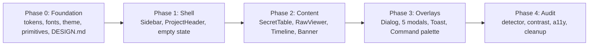

# EnVault UI/UX Revamp: Restrained Design System, No Slop

## Goal Description

Rebuild the EnVault renderer so it reads as a professional, minimal, deliberately designed desktop tool, not a generated one.

The previous redesign (commit `62c324c`) applied the Laws of UI/UX at the interaction level but leaned on exactly the visual habits that [Impeccable](https://impeccable.style/slop) catalogues as AI slop: pulsing status dots, mint glow shadows, a gradient logo tile, icon tiles above headings, identical card grids, bounce-style `active:scale`, and 10 to 11px interface text. This plan removes those, replaces the ad hoc `palette-*` colors with a small semantic token system, and rebuilds every component on shared primitives.

**Decisions already confirmed with you**

| Topic | Decision |
| :--- | :--- |
| Color | Drop Mint/Teal. Neutral monochrome plus **one** new accent |
| Theme | Light and dark, with a manual toggle in the UI |
| Type | Bundled **IBM Plex Sans** (UI) and **IBM Plex Mono** (secrets), fully offline |
| Scope | Keep the three-pane layout. Rebuild every component. Add Cmd+K command palette and a denser, table-first secrets view |

---

## Research Synthesis

### What each reference contributes

| Source | What it actually offers | How this plan uses it |
| :--- | :--- | :--- |
| [Impeccable](https://impeccable.style/slop) | 67 anti-pattern rules in 9 groups (Visual Details, Typography, Color, Layout, Motion, Copy, Imagery, General quality, Design system). Mode taxonomy: Persuade, **Operate**, Read, Experience. Command vocabulary (`distill`, `clarify`, `polish`, `harden`, `audit`) and `PRODUCT.md` / `DESIGN.md` records | EnVault is an **Operate**-mode product: efficient, frequent actions, no persuasion chrome. The catalogue becomes the acceptance checklist. We add `PRODUCT.md` and `DESIGN.md` so the system is recorded |
| [getdesign.md](https://getdesign.md/) | The `DESIGN.md` convention (Google's spec): colors, type, spacing, components, and the reasoning behind them, so every screen follows one visual language. Its catalogue describes Linear as "ultra-minimal, precise", and Mobbin as "gallery-white monochrome" | Author a `DESIGN.md` for EnVault. Use Linear-class patterns (surface ladder instead of shadows, hairlines, dense rows, keyboard first) as the reference |
| [Mobbin](https://mobbin.com/discover/apps/web/top) | Gated behind login and client rendering, so I could not read it directly. I used its published design system listing on getdesign.md plus the shared conventions of top productivity apps (Linear, Notion, Raycast, Vercel): command palette, surface-level depth, hairline borders, strict type hierarchy | Patterns adopted: Cmd+K palette, flat list rows, hairline dividers, no card nesting. **No Mobbin screenshots were analyzed**; see Open Questions |
| [Laws of UX](https://lawsofux.com/) | Psychology: Hick, Miller, Jakob, Doherty, Fitts, Postel, Tesler, Von Restorff, Serial Position, Peak-End, Aesthetic-Usability, Zeigarnik | Mapped to concrete decisions in the table below |
| [Laws of UI](https://www.uilaws.com/) | Visual principles: hierarchy, proximity, contrast, alignment, consistency, common region | Same mapping |

### Impeccable catalogue rules that bind this work

Visual: no glassmorphism, no glow, no side-tab accent borders, no hairline-plus-wide-shadow, no extreme radii, no decorative grids.
Typography: no tiny interface text, no icon tile above heading, no label above heading, no badge above headline, no gradient text, no flat hierarchy, avoid overused fonts.
Color: no AI palette (purple or bright cyan on dark), no radial halos, no spotlight glows, no gray on colored fills.
Layout: no nested cards, no identical card grids, no monotonous spacing, no hero metric, line length capped.
Motion: no pulsing status dot, no bounce or elastic easing, no layout-animating transitions.
Copy: no em dash overuse, no generic claims, no forced contrast, no redundant text in one container.
Quality: WCAG AA contrast, heading order, 1.5 line height, no cramped padding.

---

## Audit of the Current UI

Measured with `grep` across `src/renderer/src` (2,795 lines):

| Tell (Impeccable rule) | Occurrences | Where |
| :--- | :---: | :--- |
| Pulsing/ping status dot (`animate-ping`, `animate-pulse`) | 7 | Sidebar footer, ProjectHeader watcher, VersionTimeline, MissingFileBanner, ComputerScanModal |
| Glow and heavy shadows (`shadow-palette-mint/*`, `shadow-2xl/xl/lg`) | 29 | Buttons, modals, empty state |
| Gradient fills (`bg-gradient`, `from-palette`) | 6 | Logo tile, empty-state logo, banner |
| Bounce-style press (`active:scale-*`) | 21 | Nearly every button |
| Tiny interface text (`text-[10px]`, `text-[11px]`) | 69 | Badges, metadata, helper text |
| Extreme radius (`rounded-2xl/3xl/[22px]`) | 11 | Modals, empty state, cards |
| Backdrop blur / glass | 6 | Modal scrims, toasts |
| Icon tile above heading | 3 | Empty states, modal headers |
| Identical card grid | 2 | Welcome screen action cards, scan summary stats |
| Nested cards (card inside card inside modal) | several | Import checklist, scan modal, diff rows |
| Redundant text in one container | several | Modal title plus subtitle plus banner repeating the same fact |
| "Mint on near-black" palette | all views | Reads as the "dark with glowing accents" default |

**Latent bugs found during the audit (fixed in Phase 0):**
- `animate-fade-in` is used 9 times but is **not defined** in `tailwind.config.js`, so those classes do nothing.
- `py-0.2` is used 14 times and is **not a valid Tailwind class**; the padding silently does not apply.

> [!NOTE]
> This is partly self-inflicted: the last revamp added several of these tells. This plan treats that as a correction, not a restyle on top.

---

## Design Direction

**Product mode:** Operate. People open EnVault to confirm a secret is safe, copy a value, or recover a file. Calm, fast, legible, and keyboard-reachable beats expressive.

**Personality in one line:** a quiet vault ledger. Neutral surfaces, one blue signal, monospace only where secrets live.

**Principles**
1. Structure comes from space, type, and hairlines. Not boxes, not shadows.
2. One accent, used for the primary action and the current selection only.
3. Status colors (danger, success, warning) carry meaning only. Never decoration.
4. Static by default. Motion only for real activity (a scan running, a snapshot in flight) and 120 to 160ms state changes.
5. Every control is reachable by keyboard, and its shortcut is shown where it is used.

### Token system (to be recorded in `DESIGN.md`)

Contrast ratios below were computed (WCAG 2.x relative luminance), not estimated.

| Token | Dark | Light | Use |
| :--- | :--- | :--- | :--- |
| `canvas` | `#0B0B0C` | `#FAFAFA` | App background |
| `surface` | `#111113` | `#FFFFFF` | Sidebar, panels, table body |
| `raised` | `#17171A` | `#F4F4F5` | Hover rows, popovers, inputs |
| `line-subtle` | `#232327` | `#E4E4E7` | Dividers between rows |
| `line` | `#2E2E33` | `#D4D4D8` | Panel edges |
| `line-strong` | to verify | to verify | Input and control boundaries (must reach 3:1, WCAG 1.4.11) |
| `fg` | `#ECECEE` | `#18181B` | Primary text |
| `fg-muted` | `#A1A1AA` | `#52525B` | Secondary text |
| `fg-subtle` | `#8B8B94` | `#6B6B74` | Metadata (minimum 12px) |
| `accent` | `#6E9BFF` | `#2F5FD0` | Primary action, selection, focus ring |
| `on-accent` | `#0B0B0C` | `#FFFFFF` | Text on accent fills |
| `danger` | `#F2686D` | `#CE2C31` | Destructive and missing-file |
| `success` | `#4CC38A` | `#18794E` | Saved and verified |
| `warn` | `#F5A524` | `#AD5700` | Reuse warning |

Worst-case text contrast: dark `fg-subtle` on `raised` is **5.3:1**; light `fg-subtle` on `raised` is **4.8:1**; all semantic colors are at least 4.6:1 on every surface; accent on canvas is 7.3:1 (dark) and 5.5:1 (light). Everything clears AA (4.5:1).

**Type** (IBM Plex Sans / IBM Plex Mono, weights 400, 500, 600)

| Role | Size / line-height | Notes |
| :--- | :--- | :--- |
| Display (empty state, modal title) | 20 / 28, 600 | Used once per screen |
| Section title | 14 / 20, 600 | |
| Body and rows | 13 / 20, 400 | Default UI size for a dense desktop app |
| Meta and captions | 12 / 16, 400 | **Floor.** Nothing below 12px |
| Secret key and value | Plex Mono 13 / 20 | Tabular numerals on counts |

> [!IMPORTANT]
> Impeccable suggests about 16px body text. EnVault is a dense Operate-mode desktop app, so 13px UI with a hard 12px floor is the deliberate, documented deviation (macOS, Linear, and Raycast all sit in this range). It removes the 69 sub-12px usages. If you prefer 14px base, it is a one-line token change.

**Spacing:** 4px base, steps 4, 8, 12, 16, 24, 32, 48. Related items sit at 4 to 8, groups at 24 or more (no monotonous spacing).
**Radius:** 4 (chips), 6 (controls), 8 (panels), 12 (dialogs). Nothing larger.
**Elevation:** none for in-flow surfaces. Overlays (dialog, palette, popover) pick **one** edge treatment: a 1px `line` border in dark, a soft shadow in light, never both.
**Hit targets:** 32px minimum control height, 36px for primary actions, icon buttons 32x32.
**Motion:** `opacity` and `transform` only, 120 to 160ms, `ease-out`, fully disabled under `prefers-reduced-motion`. No scale-on-press, no pulse, no ping, no bounce.
**Copy:** sentence case, concrete verbs, no emoji, no em dashes, no marketing language. Shortcuts appear as `Kbd` chips, not in button labels.

### Laws mapped to decisions

| Law | Decision |
| :--- | :--- |
| Hick's / Miller's | Palette consolidates actions behind one entry point. Max 5 to 7 chunks per region. One primary action per view |
| Jakob's | Cmd+K, Cmd+N, Cmd+1/2/3, Escape, arrow-key row navigation, familiar sidebar-list-detail layout |
| Fitts's | 32px minimum targets, primary action in a consistent corner, balanced 50/50 dialog footers |
| Doherty | Optimistic copy feedback under 100ms, spinner only for genuinely slow work (scan, snapshot) |
| Law of Proximity / Common Region | Value sits beside its actions. Rows separated by hairlines, not boxes |
| Von Restorff | Accent appears rarely, so the one accent element per view is the isolated one |
| Peak-End | Success states (restore, scan complete) are plain, confident, and brief, not celebratory |
| Aesthetic-Usability | Restraint and consistent alignment, not decoration |
| Postel's | Import and search accept messy input (case, partial path) and normalize |
| Tesler's | The app owns the complexity (encryption, dedupe, atomic write); the UI exposes only intent |
| Hierarchy / Contrast / Alignment | Three type steps per view, one accent, shared 4px grid and left edges |



---

## User Review Required

> [!IMPORTANT]
> **Palette change is a visible brand change.** Mint and Teal go away from the UI entirely, replacing the palette you supplied earlier. The accent becomes blue. I chose blue because it is distant from Impeccable's flagged "purple gradient / bright cyan on dark" defaults and passes AA in both themes. Confirm the hue (see Open Questions).

> [!WARNING]
> **Large diff.** Every one of the 12 renderer components is rewritten, and `palette-*` is removed. This is done in five commits (one per phase) so each is reviewable and revertible.

> [!NOTE]
> Behavior, IPC contracts, crypto, SQLite schema, the watcher, and the existing 23 tests are **not** changed. The only main-process addition is a small `theme` IPC so native chrome follows the chosen theme.

## Open Questions

> [!IMPORTANT]
> 1. **Accent hue.** Blue (`#6E9BFF` / `#2F5FD0`) is my proposal. Alternatives that also pass AA: a desaturated green (closest to the old identity, but near the old mint), or a warm amber. Which do you want?
> 2. **Mobbin references.** Mobbin requires login, so I could not review its screens. If there are specific apps or screens you want matched (for example Linear's issue list, Raycast's palette), send names or screenshots and I will fold them into `DESIGN.md` before Phase 1.
> 3. **Theme control.** I plan a three-state toggle (System, Light, Dark), defaulting to System, living in the sidebar footer and in the palette. Acceptable, or do you want strictly two states?

---

## Proposed Changes

### Phase 0: Foundation

#### [NEW] `PRODUCT.md`
Audience (developers with local `.env` files), core tasks (confirm backup, copy a value, restore), constraints (offline, no invented data), tone.

#### [NEW] `DESIGN.md`
The token tables above plus component rules and the do/don't list, following the getdesign.md structure so later work stays consistent.

#### [MODIFY] `tailwind.config.js`
Replace the `palette` object with semantic tokens driven by CSS variables so one class works in both themes.

```js
colors: {
  canvas:  'rgb(var(--canvas) / <alpha-value>)',
  surface: 'rgb(var(--surface) / <alpha-value>)',
  raised:  'rgb(var(--raised) / <alpha-value>)',
  line:    { DEFAULT: 'rgb(var(--line) / <alpha-value>)', subtle: 'rgb(var(--line-subtle) / <alpha-value>)', strong: 'rgb(var(--line-strong) / <alpha-value>)' },
  fg:      { DEFAULT: 'rgb(var(--fg) / <alpha-value>)', muted: 'rgb(var(--fg-muted) / <alpha-value>)', subtle: 'rgb(var(--fg-subtle) / <alpha-value>)' },
  accent:  { DEFAULT: 'rgb(var(--accent) / <alpha-value>)', hover: 'rgb(var(--accent-hover) / <alpha-value>)', fg: 'rgb(var(--on-accent) / <alpha-value>)' },
  danger: 'rgb(var(--danger) / <alpha-value>)',
  success: 'rgb(var(--success) / <alpha-value>)',
  warn: 'rgb(var(--warn) / <alpha-value>)'
},
fontFamily: { sans: ['"IBM Plex Sans"', 'system-ui', 'sans-serif'], mono: ['"IBM Plex Mono"', 'ui-monospace', 'monospace'] },
fontSize: { meta: ['12px', '16px'], ui: ['13px', '20px'], title: ['14px', '20px'], display: ['20px', '28px'] },
borderRadius: { chip: '4px', control: '6px', panel: '8px', dialog: '12px' },
keyframes: { 'fade-in': { from: { opacity: '0' }, to: { opacity: '1' } } },
animation: { 'fade-in': 'fade-in 140ms ease-out' }
```

This also defines the previously missing `fade-in` animation.

#### [MODIFY] `globals.css`
`:root` (dark) and `[data-theme="light"]` variable blocks, `color-scheme`, neutral scrollbars (no mint), focus ring (`outline: 2px solid accent; outline-offset: 2px` on `:focus-visible`), `prefers-reduced-motion` override, `font-variant-numeric: tabular-nums` utility.

#### [MODIFY] `main.tsx`, `package.json`
Import `@fontsource/ibm-plex-sans` (400, 500, 600) and `@fontsource/ibm-plex-mono` (400, 500). Vite bundles the woff2 files, so the existing `font-src 'self'` CSP is satisfied and the app stays 100% offline. Apply the stored theme before first render to avoid a flash (no inline script, because CSP is `script-src 'self'`).

#### [NEW] `src/renderer/src/theme/useTheme.ts`
`'system' | 'light' | 'dark'` state, persisted in `localStorage`, writes `data-theme` on `<html>`, follows `prefers-color-scheme` when System, and calls the theme IPC.

#### [NEW] `src/renderer/src/components/ui/`
Shared primitives so no component hand-rolls styles again: `Button` (primary, secondary, ghost, danger), `IconButton`, `Kbd`, `Badge` (neutral and status), `SegmentedControl`, `Input`, `Dialog` (focus trap, Escape, scroll lock), `Tooltip`, plus `lib/cn.ts` (uses the already installed `clsx` and `tailwind-merge`).

#### [MODIFY] main process, preload, shared (theme sync only)
`ipcChannels.ts` (`THEME_SET`), `handlers.ts` (set `nativeTheme.themeSource`), `preload/index.ts` and `index.d.ts` (expose `theme.set`), `main/index.ts` (initial `backgroundColor` from `nativeTheme`). Keeps the traffic lights, scrollbars, and window background consistent with the chosen theme.

---

### Phase 1: Shell

#### [MODIFY] `Sidebar.tsx`
- Wordmark only: "EnVault" in 14px semibold. Remove the gradient tile, the version pill, and the tagline.
- Two actions: **Add folder** (secondary button with `Kbd` `Cmd N`) and **Scan computer** (ghost). Neither is accent; accent is reserved for the one primary action per view.
- Project list is a flat list, 32px rows. Selected row uses `raised` background plus `accent` text/icon. **No side stripe.**
- Row shows name and path (12px, `fg-subtle`). Status shown only when real: a `danger` dot for missing files, a small `warn` icon for reused secrets, each with a tooltip. Count shown as plain tabular text, not a pill.
- Delete control appears on hover **and** keyboard focus, 32x32, `danger` on hover only.
- Footer: one static line, "Encrypted locally" with the key source, plus the theme toggle. **No pulsing dot.**
- Section label "Projects" stays as one quiet 12px heading with the count inline.

#### [MODIFY] `ProjectHeader.tsx`
- Title, then path in 12px mono beneath, with a "Reveal in Finder" icon button.
- Primary action **Snapshot** is the single accent button in the view.
- File tabs become a text tab strip with an underline for the active file (not pills), scrollable with edge fade. Missing-file marker is a static `danger` dot.
- View switch uses `SegmentedControl` (Secrets, Raw, History) with counts as tabular text.
- Remove the "Live Watcher" chip. Watcher state is shown in the sidebar footer only when it is abnormal.

#### [MODIFY] `App.tsx`
- Global shortcuts consolidated into one hook; add Cmd+K palette (replaces focus-search).
- **Empty state:** one heading ("Back up your .env files"), one sentence, one primary button (**Add folder**), and a secondary text link (**Scan computer**). Removes the identical two-card grid, the gradient logo, and the trust-pill row.
- Per-file empty state: one line and one button, no icon tile.

---

### Phase 2: Content views

#### [MODIFY] `SecretTable.tsx` (table-first)
- Real table semantics with a sticky header: **Key**, **Value**, actions. Rows divided by `line-subtle`, 36px tall, no outer card.
- Value cell: masked dots in `fg-subtle`, revealed in Plex Mono `fg`. Reveal and Copy sit **adjacent to the value** (Proximity), visible at 100% opacity on hover and focus-within, always focusable.
- Click key copies key, Copy copies value. Feedback is inline ("Copied") for 1.5s, no popping badge.
- Arrow keys move row focus, `Enter` toggles reveal, `C` copies value.
- Reuse indicator: a `warn` icon button opens a popover listing other projects (single edge treatment, closes on Escape and outside click). Copy explains the fact once, concisely.
- Filter input with clear button, result count, and a one-line zero-results state with a "Clear filter" action.

#### [MODIFY] `RawViewer.tsx`
Keep line numbers and key/value coloring, but color from tokens: key `fg`, `=` `fg-subtle`, value `fg-muted`, comment `fg-subtle` (no italics for decoration). Toolbar: mask toggle and Copy, line/char counts as plain meta text.

#### [MODIFY] `VersionTimeline.tsx`
Flat list with a 1px rail and 8px node, **no card per version**, rows divided by hairlines (Continuity without nested boxes). Current version marked with an `accent` filled node, static. Relative time with the exact timestamp in a tooltip. Row actions: Compare, Restore (secondary buttons). Source as plain text ("Auto", "Manual", "Restored"), hash in mono meta.

#### [MODIFY] `MissingFileBanner.tsx`
Inline notice at the top of the content area: `danger` icon, "`.env.local` is missing from disk. Version 4 is saved." and one **Restore file** button. Static, no gradient, no pulse, no "recovery station" language.

---

### Phase 3: Overlays and feedback

#### [MODIFY] all five modals onto `Dialog`
`DeleteProjectModal`, `ConfirmRestoreModal`, `ImportChecklistModal`, `DiffModal`, `ComputerScanModal`.
- One title per dialog, no icon tile, no subtitle that repeats the title, 12px max radius, a solid scrim with **no backdrop blur**.
- Footers: balanced buttons, primary on the right, `Kbd` hint "Esc" beside Cancel (not inside the label).
- Delete remains the safest-by-default pattern (the "files on disk are not deleted" fact stated once).
- Import: filters become a small segmented control (Recommended, All, None). Rows are checkboxes in a flat list, not bordered cards.
- Diff: counts as plain inline text ("2 added, 1 removed, 3 changed") with `success` / `danger` / `warn` used as small markers, not filled chips. Rows are a flat table.
- Scan: while running, show a determinate-or-indeterminate bar and live counters as plain text; on completion, a plain summary table. No radar spin, no celebration, no stat-card trio.

#### [MODIFY] `Toast.tsx`
Flat, bottom-right, 12px radius max, no blur, type conveyed by a 16px icon and `fg`, 4s dismiss, pausable on hover, `role="status"`.

#### [NEW] `CommandPalette.tsx`
Cmd+K opens a centered palette: search input, grouped results (Projects, Actions, View, Theme), `Kbd` hints, arrow keys and Enter, Escape closes, fuzzy match implemented in-house (about 40 lines, no new dependency). Actions: Add folder, Scan computer, Snapshot now, switch view, set theme, jump to project.

---

### Phase 4: Audit, cleanup, guardrails

#### [DELETE] legacy `palette-*` tokens and unused classes
After all components migrate, remove the `palette` block and run a grep to confirm zero references.

#### [NEW] `scripts/design-lint.mjs` and `npm run lint:design`
A small, dependency-free guard that fails on the banned patterns this plan removes: `animate-ping|animate-pulse`, `bg-gradient|from-|to-` on fills, `shadow-(xl|2xl)`, `backdrop-blur`, `text-\[(9|10|11)px\]`, `rounded-(2xl|3xl)`, `active:scale`, `py-0\.2`, em dashes and emoji in UI strings. Keeps the system from drifting back.

#### [MODIFY] `README.md`
Add a short "Design system" section linking `DESIGN.md`, and the keyboard shortcut table (no emoji).

---

## Verification Plan

### Automated Tests
```bash
npm run typecheck      # tsc, node and web configs
npm test               # existing 23 tests must stay green (no behavior change)
npm run build          # production bundle
npm run lint:design    # new banned-pattern guard, must report 0 findings
```

Contrast gate: a throwaway script (same math used above) recomputes every text/surface pair for both themes and the `line-strong` input boundary (target at least 3:1). It must show **no pair under 4.5:1 for text and no control boundary under 3:1**.

Optional: `npx impeccable detect src/renderer/src`. I have not verified that the detector runs on an Electron/React source tree offline. If it does, its output is added to the walkthrough. If it does not, `lint:design` plus the manual review below cover the same rules.

### Manual Verification (you, in `npm run dev`)
1. **Both themes:** toggle System, Light, Dark. Check the window background, scrollbars, and traffic lights match with no flash on launch.
2. **Anti-slop pass:** nothing pulses or glows, no gradients, no cards inside cards, no text smaller than 12px, accent appears on one control per view.
3. **Keyboard only:** Cmd+K palette, Cmd+N, Cmd+1/2/3, arrow keys in the secrets table, Escape closes every overlay, Tab order is logical, focus ring always visible.
4. **Flows:** add a folder, run a scan, copy a key and a value, reveal and mask, snapshot, compare two versions, restore a deleted file, delete a project.
5. **Offline fonts:** with networking off, Plex Sans and Plex Mono still render.
6. **Narrow window:** resize to the 860px minimum width; nothing overlaps or clips (popovers and menus are not cut off).

### Success Criteria
- Zero hits from `lint:design`; typecheck, tests, and build green.
- All text at least AA in both themes.
- A reviewer cannot point to a single Impeccable catalogue pattern still present in the renderer.

---

## Risks and Mitigations

| Risk | Mitigation |
| :--- | :--- |
| Large rewrite regresses behavior | Props and IPC contracts frozen; five phase commits; 23 existing tests plus manual flow checklist |
| No renderer tests exist | Add `lint:design` and contrast gates now. Component tests are out of scope for this pass, noted as a follow-up |
| Theme flash on launch | Apply theme in `main.tsx` before `createRoot`, and set `BrowserWindow.backgroundColor` from `nativeTheme` |
| Blue accent is a brand departure | Confirm hue before Phase 0; the accent is two tokens, trivial to change |
| 13px base may feel small | Documented floor of 12px and one-line token change if you prefer 14px |
| Command palette scope creep | Fixed action list, in-house fuzzy match, no new dependency |
