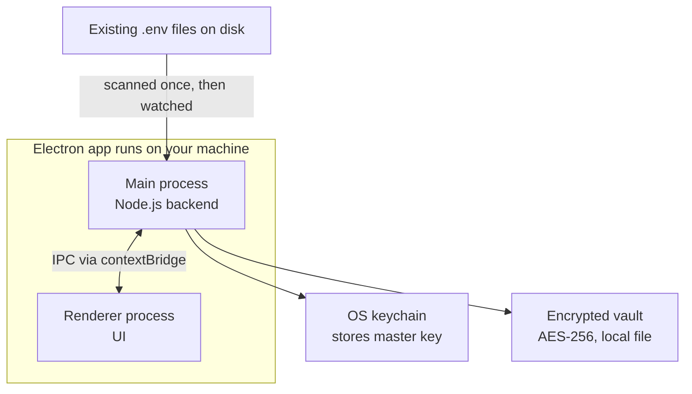
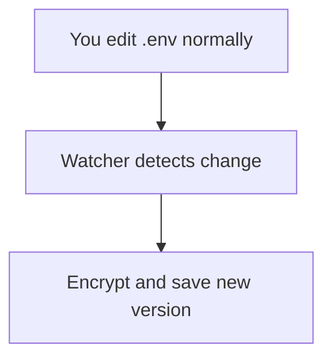
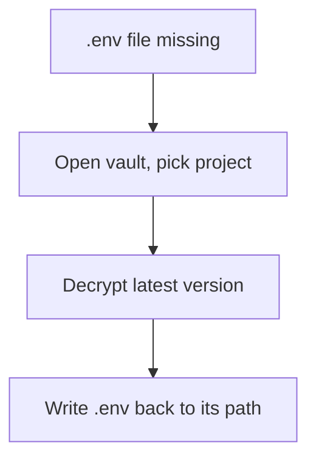

# 🔒 Envault — Project Hub

> **Delete the project. Keep the secrets.**
>
> A passive, encrypted, versioned backup system for `.env` files. Watches your projects in the background, keeps an encrypted history of every secret, and restores a file automatically if it's ever lost — with zero change to how you run your code day-to-day.

---

## Table of Contents

- [Overview](#overview)
- [Problem & Evidence](#problem--evidence)
- [Product Decisions](#product-decisions-and-what-got-rejected)
- [Feature List](#feature-list)
- [System Design](#system-design)
- [Architecture](#architecture)
- [Core Flows](#core-flows)
- [UI/UX](#uiux)
- [Tech Stack](#tech-stack)
- [Monetization](#monetization)
- [Roadmap](#roadmap)
- [Portfolio Talking Points](#portfolio-talking-points)
- [Naming & Tagline](#naming--tagline)

---

## Overview

**One keyword:** Backup.

**What it is:** a local desktop app (Electron) that scans your project folders for `.env` files, encrypts and versions them at rest, and silently keeps backing them up as they change — no cloud, no account, no AI.

**Who it's for:** a developer running many separate projects at once (the original use case: juggling `.env` files across 15+ enterprise and indie projects) who wants a safety net without adding a new step to their daily workflow.

**Target platform:** macOS + Windows, single downloadable app, no login.

---

## Problem & Evidence

### Problem 1 — .env sprawl (losing track across projects)

Scattered `.env` files across project folders, losing config when archiving old projects, and confusion between build-time and runtime variables are a widely documented, repeated developer complaint (sources: Build with Matija blog, EnvManager, dev.to; a dotnet SDK GitHub issue, #33241, explicitly requests easier per-environment secret switching).

### Problem 2 — secrets get committed to git and never fully disappear

This is the sharper, better-evidenced problem, and the one Envault's backup and versioning directly targets:

- GitGuardian's *State of Secrets Sprawl 2026* report: **28.65 million new hardcoded secrets found in public GitHub commits in 2025 alone** — a 34% year-over-year increase, the largest single-year jump on record.
- Same report: **64% of secrets confirmed valid in 2022 were still valid and exploitable as of January 2026** — leaked secrets tend to sit unrotated for years.
- GitGuardian 2024 report: **99% of leaked secrets were found in source code files** specifically, not issues, PRs, or gists — overwhelmingly a "the file got committed" problem.
- Individual developer accounts confirm this is routine, not rare: a Medium post titled *"How I Accidentally Exposed My .env File, Rewrote Git History, and Fixed It Without Losing My Project"* describes discovering a `.env` was still in git history months after adding it to `.gitignore` — because `.gitignore` only stops future commits, not past ones.

### What this is not solving

Deploying secrets to a production server is a separate problem, handled by CI/CD secret stores and PaaS dashboards. Envault's scope is local development machines only. A future export feature (pushing values to GitHub Actions, Vercel, or Railway) is the honest way to touch that problem without adding a daily step.

---

## Product Decisions (and what got rejected)

| Idea | Why it was rejected | What replaced it |
| --- | --- | --- |
| "Run with injected env" button — spawn a process with secrets loaded, no `.env` file needed | Solves a problem that doesn't exist day-to-day; a `.env` file is copy-pasted once and just sits there — no repeated action to save time on | Nothing — the file keeps existing and working exactly as it does today |
| Shell hook, direnv-style auto-load on `cd` | Adds a one-time setup ritual per project for a workflow problem that was never real | Dropped entirely |

**Final direction:** Envault is a passive watcher and backup layer, not a new way of running projects. The only new UI in a developer's life is opening the app for the rare cases: initial project connect, disaster recovery, or credential rotation.

---

## Feature List

### Core (v1 — must ship)

- **Project registration** — point the app at a folder once; it finds and imports existing `.env` file(s)
- **Background file watcher** — detects any change to a registered `.env` file automatically
- **Encrypted versioning** — every detected change is saved as a new encrypted version (AES-256-GCM, key from OS keychain), never plaintext on disk
- **Restore** — if a file is missing, pick the project and write the last known version back to its original path
- **Version history / diff** — see what changed between versions, per project
- **Cross-project reuse detection** — flags when the same secret value appears in more than one project, via hash comparison, without ever displaying plaintext side-by-side across projects
- **Project list UI** — sidebar of all registered projects, searchable

### Nice-to-have (v1.5)

- **Manual masked view** — reveal-on-click for any stored value
- **Export to deploy targets** — push values to GitHub Actions secrets, Vercel, or Railway env vars
- **Missing-file detection on launch** — proactively flags a gone `.env` at app open
- **Rotation reminder** — flags secrets untouched for N months, paired with reuse detection

### Explicitly out of scope

- "Run with injected env" / process-spawning
- Shell hook / auto-load on `cd`
- Any GUI step inside the daily dev loop
- Production/server secret deployment beyond the optional export feature above

---

## System Design

### Functional requirements

- Detect `.env` files across arbitrary project folders (manual add plus optional scan of common dev directories)
- Store, view, and search secrets grouped by project
- Encrypt everything at rest
- Version history per value, with diff and rollback
- Detect external changes and reconcile instead of silently overwriting

### Non-functional requirements

- Offline-first, zero network calls aside from the optional export feature
- Cross-platform: macOS Keychain, Windows Credential Manager, Linux libsecret
- Fast cold start — secrets decrypted on demand, not all at boot
- Fails safe — if the keychain key is missing or corrupted, refuse to write rather than produce garbage

### Data model

```text
Project
 ├─ id (uuid)
 ├─ name
 ├─ path (folder location)
 └─ envFiles[]

EnvFile
 ├─ id (uuid)
 ├─ projectId (fk)
 ├─ originalPath (e.g. .env, .env.production)
 ├─ currentVersion (fk to EnvVersion)
 └─ versions[] (history)

EnvVersion
 ├─ id (uuid)
 ├─ envFileId (fk)
 ├─ ciphertext (encrypted key=value blob)
 ├─ createdAt
 └─ note (optional, e.g. rotated DB password)
```

Stored in SQLite, one row per version, rather than one blob per project — cheaper diffs, easier rollback, easier cross-project search.

### Key algorithms

- **Encryption:** AES-256-GCM with envelope encryption — a per-vault data-encryption key encrypts each version, and that key is itself encrypted by a key stored in the OS keychain, so rotating the master key later doesn't require re-encrypting every version
- **Parsing:** a tolerant `.env` parser handling quoted values, comments, multiline, and `export KEY=`
- **Reuse detection:** hash each key/value pair and compare hashes across projects, never comparing decrypted plaintext side-by-side
- **Atomic writes:** write to a temp file, then rename over the real file, so a crash mid-write can't corrupt the vault
- **External-change detection:** hash the real file on disk; if it changes outside the app, prompt reconcile-or-overwrite instead of silently clobbering

### Edge cases

- Tracked project folder deleted or moved — mark it missing, don't crash
- Same key, different projects — always scoped by project, never global
- Keychain locked or unavailable, such as headless Linux — fall back to a password-derived key (Argon2 or PBKDF2) with a clear warning that it's weaker
- A file created and deleted faster than the watcher notices — nothing to restore; the tool only protects what it had a chance to record

### Security threat model

**Protects against:** disk theft or backup leaks (ciphertext is useless without the OS key), accidental git commits (secrets never touch the plaintext project folder once migrated), shoulder-surfing (masked by default)

**Does not protect against:** a compromised OS session (malware with keychain access has your secrets — no local tool defends against that), a malicious IPC message from a compromised renderer (mitigated by validating every IPC payload's shape and origin in main, never trusting renderer input blindly)

---

## Architecture



- **Main process** — the only part allowed to touch the filesystem and encryption keys: scans and watches `.env` files, encrypts and decrypts, mediates keychain and vault access
- **Renderer process** — UI only, project list, editor, diff view; no direct filesystem or key access, by design
- **IPC via contextBridge** — the only channel between them; the renderer can only call a small set of validated methods, never a raw Node API
- **OS keychain** — holds the master encryption key only, never the secrets themselves
- **Encrypted vault** — local SQLite file holding every version, encrypted with AES-256

---

## Core Flows

**Background backup, runs constantly and invisibly:**



**Restore, the one manual step, used rarely:**



---

## UI/UX

**Layout:** a header with app name and search, a left sidebar of registered projects, and a main panel showing the selected project's variables.

**Key decisions:**

- Values masked by default with dots; an eye icon reveals on click, protecting against shoulder-surfing and accidental screen-share leaks
- Sidebar mirrors the developer's real project list, so the tool feels like theirs, not generic
- Monospace font for keys and values, sans-serif for everything else, signaling "this is config" without needing a label
- Recent-changes panel with one-click restore — the version history and disaster-recovery feature made visible, not buried in a menu

---

## Tech Stack

- **Shell:** Electron, with the main and renderer processes split, `contextIsolation` on, `nodeIntegration` off, `sandbox` on
- **UI:** React or Vue in the renderer
- **File watching:** chokidar
- **Encryption:** Node's built-in `crypto` module for AES-256-GCM, plus Electron's `safeStorage` for OS keychain access
- **Storage:** SQLite via better-sqlite3
- **Packaging:** electron-builder plus electron-updater, with code signing and notarization for macOS and Windows

---

## Monetization

One-time license with a perpetual fallback, meaning updates for a fixed window and the last working version kept forever — the proven Sublime-Text-style model for solo-dev desktop utilities. Licensing via Gumroad or Lemon Squeezy, offline signed-license verification with Ed25519 or JWT, device binding via node-machine-id. Target price: **$15 to $25 one-time**, in line with comparable single-purpose dev utilities.

---

## Roadmap

1. **Weeks 1 to 2:** project registration, scan, background watcher, encryption, SQLite vault — the core loop working end to end
2. **Weeks 2 to 3:** restore flow, version history and diff UI, cross-project reuse detection
3. **Week 3 onward:** packaging, code signing, landing page, ship v1; nice-to-haves such as export and rotation reminders as v1.5

---

## Portfolio Talking Points

- Process separation and secure IPC via contextBridge, with no raw Node exposure to the renderer — the exact pattern Electron hiring guides test for
- Encryption-at-rest with envelope encryption and OS keychain integration, cross-platform
- An explicit, stated threat model — what it protects against and what it doesn't, rather than a vague "it's secure" claim
- A real product pivot in the design process: an over-engineered "run with env" workflow feature was proposed, challenged, and cut in favor of a simpler, higher-value passive backup model — a good story about scoping and listening to feedback rather than building everything that sounds clever

---

## Naming & Tagline

**Working name:** Envault

**Tagline options:**

- "Delete the project. Keep the secrets." *(strongest — leads with the actual payoff)*
- "Your .env files, backed up before you even think to ask."
- "Never lose a secret again — automatic, encrypted backups for every project."
- "One vault. Every project's secrets. Never lost."
